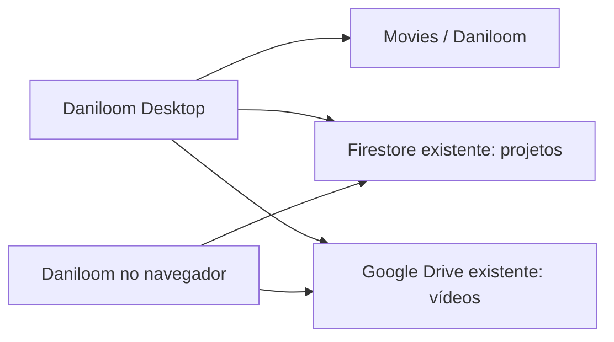

# Daniloom Desktop para macOS

O desktop reutiliza o React, os componentes e os temas do Daniloom. Electron fornece a seleção de tela/janela, as permissões do macOS, os atalhos globais, os controles flutuantes e a gravação incremental em disco. Screendrop foi consultado como referência de funcionamento; seu código e seu design não foram copiados.

## Aplicativo pronto

O ícone do aplicativo e o símbolo da barra superior são derivados diretamente do SVG do logo, preservando a mesma marca do favicon. `npm run desktop:icons` gera o PNG de 1024 px, o arquivo ICNS e os ícones template da barra.

O instalador para Macs Apple Silicon fica em `release/Daniloom-0.3.0-arm64.dmg`. Abra o DMG e arraste Daniloom para Aplicativos. A compilação local não tem assinatura Developer ID nem notarização; se o macOS impedir a abertura, use Ajustes do Sistema → Privacidade e Segurança → Abrir Mesmo Assim, após tentar abrir o app.

## Primeiro uso

1. Ao abrir o Daniloom Desktop, autorize as solicitações nativas de câmera, microfone, tela e áudio do sistema. Depois clique em **Fazer Login**. O navegador padrão abre uma página local do próprio app. Clique em **Conectar com Google**. Nenhum token é colocado na URL; a autorização retorna por POST ao serviço local com um código aleatório de uso único e prazo de cinco minutos.
2. **localhost já está autorizado no Firebase atual**, confirmado por consulta somente de leitura à configuração pública do projeto. O desktop usa `signInWithCredential`; a autorização por popup acontece somente no navegador. Se trocar de projeto Firebase e surgir `auth/unauthorized-domain`, adicione localhost em Authentication → Settings → Authorized domains.
3. No Workspace, clique no ícone **Projetos**, abra um projeto e use sua ação de ativação. Os projetos existentes dependem das regras atuais do Firestore: o acesso administrativo é exclusivo de `oi@daniilo.dev`.
4. Volte ao Studio, escolha modo, câmera, microfone e qualidade e inicie a gravação. Autorize as permissões de tela, áudio, câmera e microfone que o macOS solicitar. O dropdown nativo lista Desktop, os nomes das janelas abertas e Selecionar área, sem previews ou uma segunda janela. Para área, escolha o monitor quando houver mais de um e arraste sobre a tela; Esc cancela. O recorte é aplicado ao stream antes da prévia e da gravação.
5. Ao parar, a gravação fica na timeline e em `~/Movies/Daniloom/`. Com projeto ativo e autorização válida, o vídeo é enviado automaticamente à pasta desse projeto no Drive. O ícone **Enviar ao projeto** no Workspace repete um envio pendente e evita duplicar o mesmo clipe no projeto.
6. No Workspace, clique no ícone **Abrir no navegador** para ver `http://localhost:47831/media`. Essa biblioteca usa os mesmos projetos do Firestore e os vídeos do Drive; a sessão do navegador é independente da sessão desktop. Clique em atualizar na biblioteca após um novo envio.

O app desktop precisa permanecer aberto para servir os endereços `localhost`. A biblioteca publicada pode funcionar sem o desktop após publicar a atualização web descrita abaixo.

## Mesmo banco e mesmo armazenamento



Não há outro banco, bucket ou chave de serviço. Os vídeos são enviados com o token Google do usuário e as permissões já utilizadas pelo Daniloom. O envio usa blocos de 8 MiB, conserva a sessão de upload para novas tentativas, consulta o progresso confirmado pelo Drive e identifica clipes por `appProperties` para evitar duplicatas. Gravações locais não são compartilhadas entre aplicativos por IndexedDB; o compartilhamento é feito pelo Drive.

Uma gravação sem projeto ativo fica somente no Mac/Studio. Ative um projeto e clique em **Enviar ao projeto** para publicá-la nele. Os envios automáticos usam o projeto que estava ativo no início da gravação.

## Site publicado no AI Studio

Na inspeção de 6 de outubro de 2026, o bundle de `https://daniloom.ai.studio/` não continha as rotas `/projects` e `/media` nem a integração de projetos presente no código local. Para ver os vídeos também nesse domínio, publique a versão atualizada deste projeto pelo fluxo habitual do Google AI Studio. As rotas de biblioteca, projetos e detalhes já estão conectadas em `src/main.tsx`.

O banco e o Drive já são os mesmos, portanto não é necessário migrar vídeos. Esta execução não publicou nem alterou o site hospedado, as regras do Firestore ou os domínios autorizados do Firebase.

## Controles desktop

- **⌘⌥⇧R**: gravar, pausar ou continuar, conforme o estado do Studio.
- **⌘⌥⇧S**: parar e salvar.
- A janela flutuante mostra tempo, pausa/continuar e parar. Pode ser arrastada pelo lado esquerdo.
- O ícone na barra superior do macOS oferece gravação rápida de tela inteira, janela ou área, pausa, continuar e parar. O ícone do Dock permanece visível; clicar nele reabre o Studio.
- Fechar o Studio mantém o app aberto na barra superior. Use Sair do Daniloom para encerrar.
- O menu do app oferece abrir o site publicado, abrir as gravações no Finder e controlar a sessão.
- Fechar a janela durante a gravação a minimiza. Sair durante a gravação ou finalização é bloqueado para preservar os dados.
- O desktop mantém os processos de renderização ativos em segundo plano e impede o repouso durante a gravação.

## Desenvolvimento

```sh
npm install
# Caso npm tenha bloqueado o script de instalação do Electron:
node node_modules/electron/install.js

npm run desktop:dev
npm run desktop:test
npm run lint
npm run desktop:build
```

`desktop:dev` compila o helper Swift, recompila o frontend e abre o desktop. O helper exige as Command Line Tools da Apple (`xcode-select --install`), sem precisar do Xcode completo. `desktop:start` abre a última compilação. `desktop:pack` cria somente o `.app`. O frontend fica empacotado no aplicativo; o servidor Express do AI Studio não é incluído. As duas rotas Gemini existentes são encaminhadas ao site publicado, preservando o segredo de API no backend. Para apontá-las a um backend local, inicie-o separadamente e use `DANILOOM_WEB_URL=http://localhost:3000 npm run desktop:start`.

O serviço HTTP se liga somente a `127.0.0.1:47831`. A porta é fixa para preservar IndexedDB, OPFS e a sessão Firebase entre execuções. Se estiver ocupada por outro processo, o app mostra um erro e não muda silenciosamente de origem. A interface privilegiada do Electron é restrita às janelas locais do app, sem Node.js no renderer, com isolamento de contexto e sandbox.

## Validação e limites desta versão

Foram validados os testes de escrita/descartes/recuperação parcial, callback de autenticação, restrições do servidor e uploads retomáveis; TypeScript e build web; abertura real da interface desktop, Dock visível, ícone ativo na barra superior, dropdown de fontes, ações desktop dentro do Workspace, seleção de área por eventos de arraste e geração do aplicativo/DMG. O teste de abertura bloqueia permissões de mídia e grava apenas um canvas sintético para verificar MediaRecorder → IPC → arquivo no disco; não grava conteúdo da tela nem acessa câmera/microfone. Login real, captura de conteúdo real com permissões do macOS, áudio do sistema e envio à conta Google precisam ser confirmados com uma sessão autorizada do usuário.

As permissões são solicitadas na inicialização por APIs nativas. Um pequeno helper Swift solicita acesso à tela e inicializa e destrói um Core Audio tap para solicitar áudio do sistema, sem registrar amostras. O ícone de permissões no Workspace permite repetir a consulta e abrir os Ajustes quando o acesso foi negado. O macOS não repete diálogos já negados; altere a permissão nos Ajustes.

O áudio do sistema depende da versão do macOS, da fonte selecionada e das permissões. Electron usa um seletor próprio para permitir o recorte por arraste; `NSAudioCaptureUsageDescription` está presente no app. Referências: [captura desktop no Electron](https://www.electronjs.org/docs/latest/api/desktop-capturer) e [seletor de mídia](https://www.electronjs.org/docs/latest/api/session#sessetdisplaymediarequesthandlerhandler-opts).

Esta versão ainda usa o compositor e o MediaRecorder do Daniloom. A cópia é escrita e sincronizada em disco a cada segundo, mas os clipes também permanecem em memória para a timeline atual: o consumo de RAM de gravações muito longas ainda não foi eliminado. Não implementa todas as funcionalidades do Screendrop, como edição de fontes separadas, cursor reconstruído ou zoom por eventos.

Arquivos com `.partial.webm` ou `.partial.mp4` são preservados se houver interrupção abrupta. Eles podem conter mídia recuperável, mas não há garantia de que um arquivo interrompido possa ser reproduzido; esta versão não faz reparo automático. Os arquivos completos podem ser importados novamente pelo botão existente de importar vídeo.

Para distribuição pública, configure um certificado Developer ID e notarização antes de gerar a versão final. O build atual é para Apple Silicon; Intel exige uma compilação separada.

### Widget e Dock (0.4.0)

Na barra superior do macOS, desmarque **Mostrar no Dock** para ocultar o ícone, mantendo o menu disponível. Essa preferência persiste ao reiniciar. **Modo widget**, também disponível pelo ícone no Workspace, recolhe o Studio e mostra um painel flutuante arrastável com Desktop, Janela ou Área, gravar, pausar/continuar e parar. Ao terminar e preparar o clipe, o Studio reaparece com a gravação selecionada. O botão Abrir Studio permite voltar durante a gravação.

### Sessão com vários clipes (0.5.0)

No widget, a tesoura salva o clipe atual e pausa a sessão. Play inicia o próximo clipe usando a mesma captura. O quadrado finaliza a sessão e abre o Studio com os clipes. Reiniciar descarta apenas o clipe em andamento e começa outro; cancelar descarta apenas o atual, mantendo os anteriores e o widget. Câmera e microfone podem ser configurados antes de gravar ou entre clipes: clique no ícone para ativar/desativar, ou na seta para escolher o dispositivo. Contagem e controles aparecem sem rótulos permanentes, com tooltips.

### Pastas por projeto (0.6.0)

As cópias locais ficam em `~/Movies/Daniloom/<nome do projeto>--<identificador>/`. O projeto é capturado no início de cada clipe, junto com o destino de sincronização. Projetos de mesmo nome têm pastas distintas; renomear um projeto mantém sua pasta existente. Gravações sem projeto ficam em `Sem projeto/`. Vídeos antigos soltos na raiz são organizados em `Gravações anteriores/`, pois não possuem identificação do projeto. Nomes são sanitizados e arquivos existentes nunca são sobrescritos durante essa organização.
